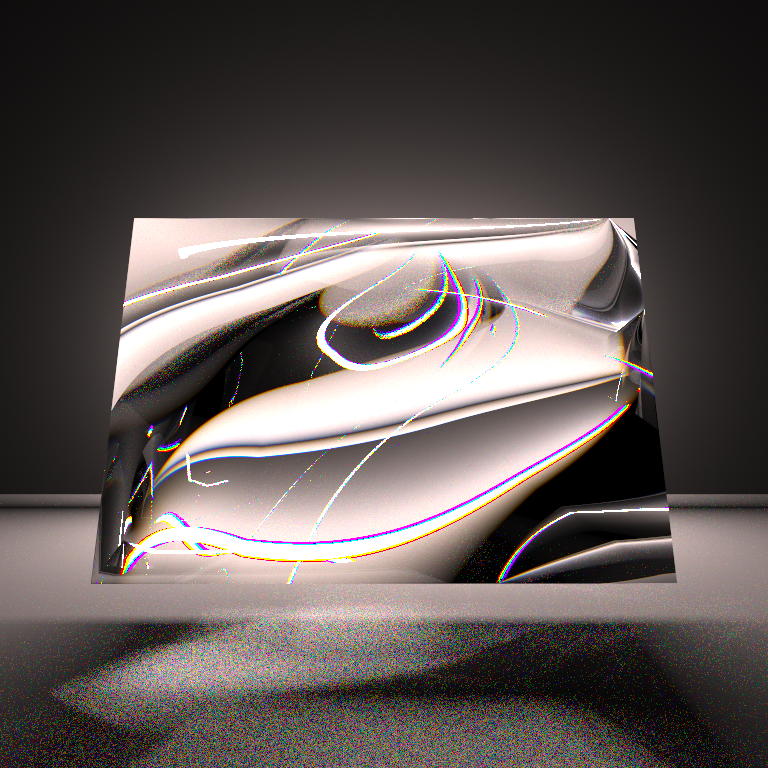

# Spectral Path Tracer — Physically-Based Dispersion & Chromatic Aberration

A GPU path tracer extended to simulate real light dispersion — rendering physically accurate
rainbows, prismatic color separation, and chromatic aberration by tracing individual wavelengths
of light instead of a single RGB approximation.

Built as a final project for Stanford CS248A (Computer Graphics: Foundations), extending the
course's Slang-based path tracer.

**Collaborators:** Olivia Doman & Daniel Reichfeld

*Rainbow fringing produced by wavelength-dependent refraction through a glass prism.*

## What it does

Standard path tracers treat light as a single RGB triplet, which makes it impossible to render
dispersive effects like prismatic rainbows or chromatic aberration in glass. This project adds a
full spectral rendering pipeline on top of the existing renderer:

- **Per-ray wavelength sampling** — each traced ray carries a single sampled wavelength (380–700nm),
  kept monochromatic end-to-end to satisfy Monte Carlo integration
- **Wavelength-dependent refraction** — glass index of refraction computed via the Cauchy dispersion
  equation (`n(λ) = A + B/λ²`), replacing the previous fixed-IOR glass BSDF
- **Spectral-to-RGB conversion** — CIE 1931 color matching functions convert each wavelength sample
  to sRGB via the IEC 61966-2-1 D65 matrix, with unclamped negative values preserved until final
  tone-mapping so they cancel correctly in the accumulation
- **Runtime toggle** — a `spectralMode` flag switches between spectral and standard RGB rendering
  with no recompilation needed

## Results

- **Glass prism**: 40° apex-angle prism producing clean rainbow separation at 2048–4096 SPP, path
  depth 6, with the Cauchy `B` constant tuned to 12,000 nm² for vivid color splitting
- **Rainbow caustics**: dispersed light re-emerging as colored caustics on a ground plane, requiring
  up to 10 refraction bounces per ray
- **Chromatic aberration**: a glass sphere showing colored fringing along the silhouette from
  wavelength-dependent exit angles, at 1024 SPP

See [`writeup.pdf`](writeup.pdf) for the full technical writeup, equations, and additional renders.

## Performance

The spectral extension adds minimal per-ray overhead — one Cauchy evaluation and one CIE table
lookup (two float ops + two lerps). The tradeoff is sample count: since each sample now carries only
one wavelength's worth of information (vs. full RGB), convergence needs more SPP — 1024 for clean
diffuse surfaces, 2048–4096 for clean glass caustics.

## Built with

Slang shader framework · CS248A path tracer base

## References

- Pharr, Jakob & Humphreys, *Physically Based Rendering*, 4th ed., MIT Press
- CIE 15:2004, *Colorimetry*, 3rd ed.
- Cauchy, A.-L. (1836), *Sur la dispersion de la lumière*
- IEC 61966-2-1:1999, *Default RGB color space — sRGB*
